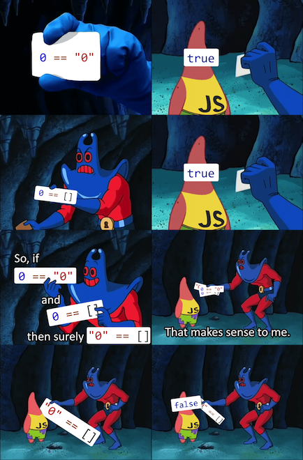

# JavaScript Basics

---

## Variable Declaration

```js
var message = "Hello World";

var greetFn = function() {
  return "Hello World";
};
```

Prefer `let` and `const`; we'll get to this in a bit!

---

## Primitive Types

```js
const aString = "Hello"; // String
const aNumber = 13; // Number
const aBoolean = true; // Boolean
const aNull = null; // Null
const anUndefined = undefined; // Undefined
const aSymbol = Symbol("a symbol"); // Symbol
```

---

## Types

```js
// Object
const anEmptyObject = {};
const anotherObject = {};
// Array
const anEmptyArray = [];
const anotherArray = ["Bob", 19, false];
```

---

## Comments

```js
// This is a line comment.
/*
This is a block style comment.
*/
```

---

## Operators

```js
// Addition
const thirteen = 5 + 8;
const concatString = "Hello " + "world!";

// Subtraction
const three = 8 - 5;
// Multiplication
const thirty = 3 * 10;
// Division
const thirtyThree = 66 / 2;
```

---

## Comparisons

```js
// Equal to
a == b; // false
// Not equal to
a != b; // true
// Less than equal to
a <= b; // true
// Greater than or equal to
a >= b; // false
// Less than
a < b; // true
// Greater than
a > b; // false
```

---

## Equality and type coercion

_Can_ be one of the more confusing aspects of JavaScript. Type coercion often applies, i.e.

```js
const equal = 0 == "0"; // true
```

---

[](https://i.redd.it/4skcofasa1p01.png)

---

### Solution?

Use strict equality comparison (`===`) over abstract equality comparison (`==`)

```js
const equal = 0 === "0"; // false
```

Also, be careful when comparing variables of different type or against null/undefined

---

## Conditionals

```js
// If statement
if (someCondition) {
  doSomething();
} else {
  doSomethingElse();
}

// Ternary
const something = someCondition ? doSomething() : doSomethingElse();
```

---

## Switch

```js
switch (someCondition) {
  case "value1":
    doSomethingWithValue1(someCondition);
    break;
  case "value2":
    doSomethingWithValue2(someCondition);
    break;
  default:
    doNothing();
}
```

---

## Logical Operators

```js
// OR
const result = a || b;

// AND
if (conditionOne && conditionTwo) {
  ...
}

// NOT
if (!conditionThree)  {
  ...
}
```

---

## Loops

```js
for (let i = 0; i < 10; i++) {
  console.log(i);
}

while (someCondition) {
  // code here continues to execute until someCondition is false
}
```

There are better ways to loop, especially when looping through arrays. We'll discuss this later.

---

## Functions

```js
function aFunctionDeclaration(anArg) {
  console.log(anArg);
}
const aFunctionExpression = function(anArg) {
  console.log(anArg);
};
const anArrowFunction = anArg => console.log(anArg);
const aNewFunction = new Function("anArg", "console.log(anArg)");

// Execution
aFunctionDeclaration("Hello");
aFunctionExpression("JS");
anArrowFunction("Workshop");
aNewFunction("!");
```
